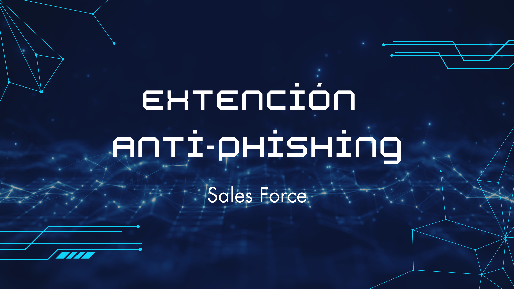

# Extensión de Navegador Anti-Phishing




## Descripción

Esta extensión de navegador anti-phishing está diseñada para proteger a los usuarios de ataques de phishing al detectar y bloquear URLs sospechosas antes de que se carguen en el navegador. La extensión analiza las URLs y el contenido web en tiempo real, alertando a los usuarios sobre posibles amenazas y proporcionando una experiencia de navegación más segura.

## Características

- **Escaneo de URLs en Tiempo Real:** Bloquea automáticamente el acceso a sitios web conocidos por phishing.
- **Análisis de Contenido:** Escanea el contenido de las páginas web en busca de palabras clave sospechosas comúnmente asociadas con intentos de phishing.
- **Interfaz de Usuario:** Incluye un popup con una función de escaneo manual para realizar verificaciones de seguridad adicionales.
- **Alertas Personalizables:** Alerta a los usuarios cuando se detecta un sitio o contenido potencialmente peligroso.

## Tecnologías

- JavaScript
- HTML/CSS
- WebExtensions API

## Uso

Instala la extensión en tu navegador y se ejecutará en segundo plano, protegiéndote de amenazas de phishing mientras navegas por la web.
1. Clona este repositorio en tu máquina local.
   ```bash
   git clone https://github.com/tu-usuario/anti-phishing-extension.git

## Licencia
Este proyecto está licenciado por Equipo Sales Force.
